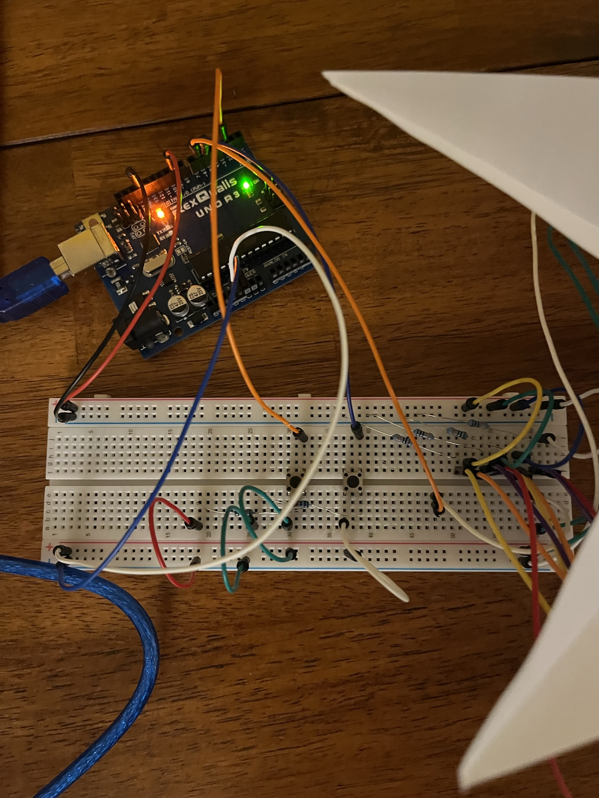

# CGT272-DynamicLamp
Program connected to breadboard that controls a paper prototype lamp with different colors. C++ used with Arduino Board controls the lamp. Project information is found on my portfolio, this lamp is part of a service design-integrated touchpoint that caters towards evening relaxation and calmness.
Here is the project https://www.masoncknight.com/copy-of-cgt-272-p1

